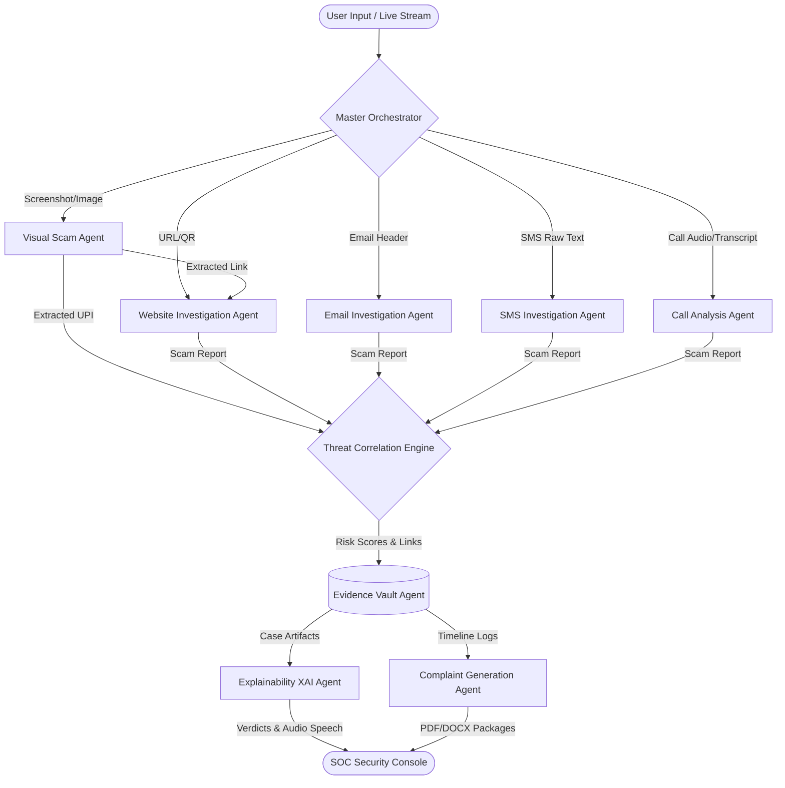

# ScamON AI

<p align="center">
  
  
  
  
  
  
</p>

An Enterprise-Grade Multi-Agent AI Cybersecurity Investigation Platform for Detecting, Investigating, Correlating, and Reporting Digital Scam Evidence.

> ### 🏛️ PS7 Upgrade: Amypo College Digital Reception & Local Knowledge System
> Built for **Problem Statement 7 (PS7)**: *"Local Database Question-Answering System (No Third-Party API)"*.
> - **100% Local Inference**: Powered by local Ollama (`llama3.1:8b`) and local ChromaDB (`nomic-embed-text`) with **zero external cloud API calls**.
> - **Institutional Knowledge Base**: Grounded across 12 official policies and structured database for **Amypo Institute of Technology** (Chennai, TN).
> - **Dual-Layer ScamON Bridge**: Cross-verifies suspicious offers, payment requests (e.g. ₹3,000 internship fee), and malicious links with ScamON forensic agents.
> - **ChatGPT-Style Conversational UI**: Interactive conversational interface with prompt cards, collapsible citations, and SOC telemetry.

---

## 📖 Introduction

In the modern threat landscape, cyber fraud is no longer confined to static phishing links. Scammers deploy highly sophisticated, multi-channel social engineering campaigns that combine malicious web domains, spoofed email headers, automated smishing texts, clone voice calls, and visual brand impersonation.

Traditional security systems fail because they analyze these channels in isolation. **ScamON AI** resolves this problem by implementing a collaborative **Multi-Agent AI Architecture**. Instead of relying on a single, general-purpose LLM which is prone to hallucination and context dilution, ScamON orchestrates independent, specialized security agents. Each agent acts as an autonomous cyber investigator that inspects its dedicated threat vector, validates evidence, and syncs telemetry to a centralized Threat Correlation engine and cryptographic Evidence Vault.

---

## 🛠️ Platform Features

- **🌐 Website & DNS Investigation**: Audits DNS configurations, SSL handshakes, domain registration age, brand typosquatting, and blacklists.
- **✉️ Header-Level Email Audits**: Inspects SMTP relay headers, SPF record configurations, DKIM cryptographic signatures, and DMARC alignments.
- **📱 Live SMS Stream Interceptor**: Connects with active Google Messages web sessions to capture incoming SMS traffic passively.
- **🖼️ Optical Character Recognition & QR Parser**: Extracts text overlays, checks UPI payment intent, decodes QR target links, and detects brand logos.
- **📞 Speech-to-Text Call Analysis**: Transcribes call recordings, extracts intent, and maps social engineering patterns.
- **🎙️ Real-time WebSockets Live Call Audits**: Listens to voice channels dynamically and flags verbal urgency and manipulation indicators.
- **🧠 Threat Correlation Engine**: Consolidates multi-vector parameters, resolves entity linkages, and calculates centralized risk scores.
- **🔒 Cryptographic Evidence Vault**: Hashes collected telemetry using SHA-256 for immutable case record integrity.
- **📝 Automated Authority Reporting**: Generates ready-to-file legal complaint packages in PDF and DOCX formats.
- **🗣️ Explainable AI (XAI)**: Generates multi-lingual voice and text walk-throughs justifying threat classifications.

---

## ⚙️ Complete Workflow & Pipeline

When a user submits evidence or a passive stream captures a threat, ScamON processes it through the following pipeline:



1. **Intake**: Threat parameters are ingested via REST APIs or real-time WebSockets.
2. **Specialized Audit**: The Orchestrator routes tasks to appropriate agents. If the Visual Agent decodes a QR link, it automatically forwards it to the Website Agent.
3. **Correlation**: Telemetry is normalized, combined, and calculated into an overall threat classification (SAFE, SUSPICIOUS, MALICIOUS).
4. **Hashing & Vaulting**: Findings are stored, hashed (SHA-256), and appended to the active Case Folder.
5. **AI Synthesis**: The XAI Agent generates reasoners, and the Complaint Agent compiles legal filings.

---

## 🧠 Multi-Agent Architecture

Unlike single monolithic LLMs, ScamON AI utilizes **Orchestrated Multi-Agent AI**. 

```
                       [ Master Orchestrator ]
                                  │
         ┌───────────────┬────────┴───────┬──────────────┐
         ▼               ▼                ▼              ▼
  [Website Agent]  [Email Agent]   [SMS Agent]    [Visual Agent]
```

### Why Independent Agents?
- **Domain Specialization**: An agent specialized in WHOIS parsing uses dedicated toolsets and prompts tailored purely for DNS forensics.
- **Parallel Processing**: Multiple agents audit separate evidence chains concurrently, reducing total execution times.
- **Fault Isolation**: If the WHOIS parser encounters a server timeout, the Email and SMS auditing engines continue running unaffected.
- **Context Preservation**: Smaller, focused prompt contexts prevent LLM attention drift and maximize analytical accuracy.

---

## 📊 Single Agent vs Multi-Agent

| Feature / Metric | Monolithic Single LLM | ScamON Multi-Agent AI |
| :--- | :--- | :--- |
| **Architecture** | Single giant prompt handling all inputs | Orchestrated specialized sub-agents |
| **Parsing Precision** | Low (mixes DNS, Email Headers, Audio) | High (isolated protocol parsers) |
| **Parallel Execution** | No (sequential analysis only) | Yes (agents run asynchronously) |
| **Fault Isolation** | None (one exception crashes run) | Excellent (partial scans still succeed) |
| **Token Utilization** | Very High (unnecessary context bloat) | Optimized (focused payloads only) |
| **Extensibility** | Hard (requires altering main prompt) | Easy (drop in a new modular agent) |
| **Real-world Suitability**| Experimental / Prototype | Enterprise SOC Ready |

---

## 📂 Folder Structure

```
Agents/
├── backend/
│   ├── agents/
│   │   ├── call_agent/          # Call Analysis & Live Call Detector Agent
│   │   ├── email/               # Header-level Email Audit Agent
│   │   ├── evidence_vault/      # Vault Manager & Case Vault Router
│   │   ├── sms_agent_package/   # SMS Forensics Package
│   │   ├── visual_scam/         # Visual Impersonation & OCR Agent
│   │   ├── website_agent/       # DNS, SSL, Brand Typosquat & Complaint Agent
│   │   ├── xai/                 # Explainability (XAI) Agent
│   │   └── history_helper.py    # Unified case query utility
│   ├── database.py              # In-memory MongoDB Mock and Live Client Selector
│   ├── main.py                  # API router aggregator (Port 8001 entrypoint)
│   └── requirements.txt         # Backend Python packages
└── frontend/
    ├── src/
    │   ├── App.jsx              # Interactive Sidebar & Security Modules
    │   ├── LandingPage.jsx      # Cyber-security Landing Page & Boot Sequence
    │   ├── index.css            # Dark Glassmorphism CSS Design system
    │   └── main.jsx             # React entrypoint
```

---

## 🔍 Individual Agent Documentation

<details>
<summary><b>1. Website Investigation Agent</b></summary>

### Purpose
Performs forensic audits of suspicious web pages, domain registration timelines, and redirection paths.

### Responsibilities
- Resolves domain names and retrieves raw WHOIS records.
- Verifies SSL certificates (Issuer, Validity Period, Self-Signed state).
- Evaluates typosquatting similarity index against major protected brand databases.
- Queries external safety registries like PhishTank.

### Pipeline
`Input URL` ➔ `WHOIS Parse` ➔ `SSL Socket Validation` ➔ `Brand Similarity Math` ➔ `Reputation Lookup` ➔ `Scam Verdict`

### Technical Details
- **APIs**: `POST /website-analysis`
- **Key Modules**: [website_agent/routes.py](file:///d:/Agents/backend/agents/website_agent/routes.py)
- **Tech Stack**: `WHOIS client`, `SSL python library`, `Levenshtein edit-distance calculations`

</details>

<details>
<summary><b>2. Email Investigation Agent</b></summary>

### Purpose
Audits incoming and pasted email packages to detect social engineering and spoofing.

### Responsibilities
- Validates SMTP transmission hops and flags relay anomalies.
- Resolves DNS records to match SPF, DKIM, and DMARC alignments.
- Analyzes body content for urgent tone, scam keywords, and suspicious URL links.

### Pipeline
`Raw Header` ➔ `Authentication Parsing` ➔ `DNS TXT Check` ➔ `Body Link Extraction` ➔ `Phishing Check`

### Technical Details
- **APIs**: `POST /api/email/fetch`, `POST /api/email/analyze`
- **Key Modules**: [email/email_agent.py](file:///d:/Agents/backend/agents/email/email_agent.py)
- **Tech Stack**: `dnspython`, `Regex header parsers`, `Groq API`

</details>

<details>
<summary><b>3. SMS Investigation Agent</b></summary>

### Purpose
Monitors mobile text streams for smishing attempts, parsing senders and tracking linked domains.

### Responsibilities
- Intercepts raw message strings from active Google Messages web sessions.
- Suppresses pre-existing unread logs at startup to prevent processing legacy messages.
- Flags suspicious senders (e.g. `VM-HDFCBK`) and scans text bodies for deceptive payload hooks.

### Pipeline
`DOM Text Capture` ➔ `De-duplication Check` ➔ `Sender Check` ➔ `Body Parsing` ➔ `Risk Verdict`

### Technical Details
- **APIs**: `POST /api/sms/analyze`, `POST /api/sms/investigations/{id}/run`
- **Key Modules**: [sms_agent_routes.py](file:///d:/Agents/backend/agents/sms_agent_routes.py)
- **Tech Stack**: `Selenium Webdriver`, `llama-3.1-8b-instant`, `FastAPI`

</details>

<details>
<summary><b>4. Visual Scam Investigation Agent</b></summary>

### Purpose
Examines screenshots, attachments, and payment QR codes to reveal hidden visual scam indicators.

### Responsibilities
- Executes OCR parsing on image overlays to extract hidden text.
- Decodes QR codes to discover encoded URL payloads or UPI transaction targets.
- Runs brand check pipelines to flag fake banking sites and corporate logo spoofs.

### Pipeline
`Image Intake` ➔ `QR Target Decode` ➔ `Tesseract OCR Extraction` ➔ `UPI Intent Audit` ➔ `Agent Redirection`

### Technical Details
- **APIs**: `POST /api/visual/analyze`
- **Key Modules**: [visual_scam/visual_agent.py](file:///d:/Agents/backend/agents/visual_scam/visual_agent.py)
- **Tech Stack**: `pytesseract`, `opencv-python`, `pillow`

</details>

<details>
<summary><b>5. Call Analysis Agent</b></summary>

### Purpose
Performs forensic transcription and content audits of call audio files and script logs.

### Responsibilities
- Transcribes `.wav` or `.mp3` call recordings.
- Detects caller intent (e.g., impersonating bank authorities, threat of account suspension).
- Identifies social engineering markers and urgency keywords.

### Pipeline
`Audio Upload` ➔ `Whisper STT Transcription` ➔ `Entity Extraction` ➔ `Scam Classification`

### Technical Details
- **APIs**: `POST /api/call/analyze`
- **Key Modules**: [call_agent/llm_analyzer.py](file:///d:/Agents/backend/agents/call_agent/llm_analyzer.py)
- **Tech Stack**: `Whisper API`, `Groq Llama-3.1`, `pydub`

</details>

<details>
<summary><b>6. Live Call Detector Agent</b></summary>

### Purpose
Maintains active real-time WebSockets monitoring of call voice streams.

### Responsibilities
- Listens to incoming chunked binary audio payloads.
- Runs continuous transcription frames.
- Triggers instant UI warning flashes when scam speech triggers are met.

### Pipeline
`WebSocket Audio Chunk` ➔ `Frame Buffer` ➔ `Fast Transcription` ➔ `Urgency Audit` ➔ `Real-time Alert`

### Technical Details
- **APIs**: `WS /api/live-call/ws`
- **Key Modules**: [call_agent/main.py](file:///d:/Agents/backend/agents/call_agent/main.py) (Running on Port 8000)
- **Tech Stack**: `WebSockets`, `FastAPI lifespan handlers`

</details>

<details>
<summary><b>7. Threat Correlation Agent</b></summary>

### Purpose
Synthesizes logs and metrics across all modular subagents to create a centralized safety score.

### Responsibilities
- Normalizes threat variables (domain reputation, text urgency, SSL state).
- Performs entity linkage checks (e.g. matching an SMS link to a scanned WHOIS domain).
- Calculates the final centralized risk metric and threat classification.

### Pipeline
`Agent Verdict Ingest` ➔ `Entity Matching` ➔ `Weighted Scoring Engine` ➔ `Case Update`

### Technical Details
- **APIs**: Internal backend pipeline
- **Key Modules**: [history_helper.py](file:///d:/Agents/backend/agents/history_helper.py)
- **Tech Stack**: `Weighted threat scoring frameworks`

</details>

<details>
<summary><b>8. Evidence Vault Agent</b></summary>

### Purpose
Maintains cryptographic integrity for all case records, timelines, and raw files.

### Responsibilities
- Generates unique Case IDs (e.g. `SCAMON-2026-000021`).
- Hashes all incoming evidence documents using SHA-256.
- Saves immutable timelines tracking exactly when an agent audited a threat.

### Pipeline
`Evidence File` ➔ `SHA-256 Hashing` ➔ `Case Database Insert` ➔ `Timeline Logging`

### Technical Details
- **APIs**: `POST /api/evidence/cases`, `POST /api/evidence/cases/{id}/status`
- **Key Modules**: [evidence_vault/routes.py](file:///d:/Agents/backend/agents/evidence_vault/routes.py)
- **Tech Stack**: `python hashlib`, `MongoDB Indexes`, `Pydantic validation schemas`

</details>

<details>
<summary><b>9. Explainability (XAI) Agent</b></summary>

### Purpose
Translates complex technical threat indicators into natural, human-understandable explanations.

### Responsibilities
- Explains why a domain or email was flagged (e.g. "Domain registered 2 days ago in an untrusted TLD").
- Provides audio TTS readbacks of scam reasoning.
- Supports multi-lingual explanations (English, Hindi, Tamil, Telugu, Malayalam, French, Arabic).

### Pipeline
`Risk Logs` ➔ `Reasoning Synthesis` ➔ `Translation Engine` ➔ `Speech Synthesis`

### Technical Details
- **APIs**: `POST /api/xai/explain`
- **Key Modules**: [xai/routes.py](file:///d:/Agents/backend/agents/xai/routes.py)
- **Tech Stack**: `Groq LLM`, `gTTS (Google Text-to-Speech)`, `speechSynthesis`

</details>

<details>
<summary><b>10. Complaint Agent</b></summary>

### Purpose
Compiles case findings into legally robust reports ready for local and national law enforcement.

### Responsibilities
- Aggregates verified timeline events, WHOIS domain data, and transcript files.
- Generates professional Cybercrime Complaint PDFs.
- Drafts editable DOCX format letters for legal teams.

### Pipeline
`Case ID Request` ➔ `Data Aggregation` ➔ `Report Generation` ➔ `PDF/DOCX Output`

### Technical Details
- **APIs**: `POST /api/complaint/generate`
- **Key Modules**: [website_agent/complaint_builder.py](file:///d:/Agents/backend/agents/website_agent/complaint_builder.py)
- **Tech Stack**: `reportlab`, `python-docx`, `python uuid`

</details>

---

## 📡 API Architecture

The platform splits API workloads into two FastAPI server instances to isolate processing loads:

### 🎙️ Audio Service APIs (Port 8000)
- `POST /api/call/analyze`: Ingests and transcribes voice call recording audio.
- `WS /api/live-call/ws`: Main WebSockets entrypoint for live audio streams.

### 💻 Main Forensics APIs (Port 8001)
- `POST /website-analysis`: Audits websites, domains, typosquatting, and SSL paths.
- `POST /api/email/analyze`: Audits raw email header structures.
- `POST /api/sms/analyze`: Receives passive intercept collector streams.
- `POST /api/sms/investigations/{id}/run`: Manually triggers LLM evaluation on collected SMS messages.
- `POST /api/visual/analyze`: Analyzes visual screenshot overlays and payment QR links.
- `POST /api/evidence/cases`: Initializes or updates case details and vault logs.
- `GET /api/evidence/cases/active`: Retrieves the active Case Folder ID.
- `POST /api/xai/explain`: Renders multilingual reasoning briefs.

---

## 🔒 Security & Forensics Integrity

1. **Cryptographic Validation**: Every artifact submitted to the Evidence Vault is run through a SHA-256 hashing algorithm. The resulting digest is stored in the database to verify that evidence is not altered.
2. **Schema Ingestion Enforcement**: Strictly enforces Pydantic schemas across all inbound JSON API payloads to prevent injection attempts.
3. **Sandbox Scraper Profiles**: The SMS Collector profile is run in an isolated workspace folder (`backend/profiles/google_messages/`) to secure authentication cookies and local web databases.

---

## 🚀 Installation & Setup

### Prerequisites
- Python 3.11+
- Node.js 18+
- Tesseract OCR Engine (installed on system PATH for the Visual Agent)

### 1. Setup backend
```bash
cd backend

# Initialize Virtual Environment
python -m venv venv
.\venv\Scripts\Activate.ps1   # Windows PowerShell
# Or source venv/bin/activate for Unix/macOS

# Install dependencies
pip install -r requirements.txt

# Configure environment variables
copy .env.example .env
```

Open `.env` and fill in your keys:
```env
GROQ_API_KEY=gsk_your_groq_api_key
MONGODB_URI=mongodb+srv://...
GMAIL_USER=your_email@gmail.com
GMAIL_APP_PASSWORD=your_app_password
```

### 2. Setup frontend
```bash
cd ../frontend
npm install
```

### 3. Run the applications
Run the following commands in separate terminals:

```bash
# Terminal 1: Run Call Agent Service (Port 8000)
cd backend
.\venv\Scripts\activate
uvicorn agents.call_agent.main:app --port 8000 --reload

# Terminal 2: Run Main Forensics Services (Port 8001)
cd backend
.\venv\Scripts\activate
uvicorn agents.website_agent.main:app --port 8001 --reload

# Terminal 3: Launch React Glassmorphism Console Dashboard
cd frontend
npm run dev
```

Navigate to **`http://localhost:5173`** to access the SOC Security Console!

---

## 🔮 Future Scope

- **👥 WhatsApp & Telegram Scraper Integrations**: Build automated scrapers to passive-monitor group channels and group scam alerts.
- **🎙️ Voice Clone Fingerprinting**: Match audio voice metrics to detect cloned AI voices.
- **🔗 Blockchain Evidence Registries**: Publish SHA-256 evidence digests to a public ledger for verifiable court admissibility.

---

## 🤝 Contributing

Contributions are welcome! Please open an issue or submit a pull request with details on your proposed agent features or core performance enhancements.

---

## 📄 License

This project is licensed under the MIT License. See [LICENSE](file:///d:/Agents/LICENSE) for details.

---

## 💖 Acknowledgements

- Built for Cyber Safety and National Security operations.
- Powered by Groq, FastAPI, and React.
